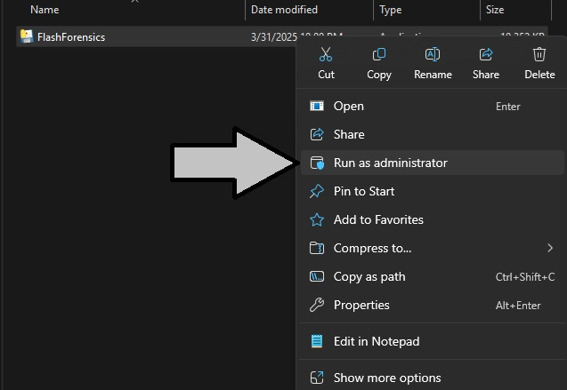
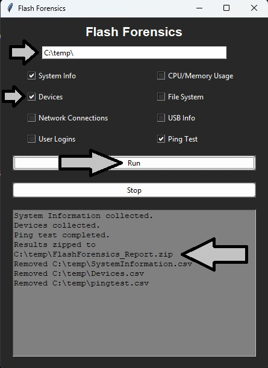

# Flash-Forensics

Helping ITs identify problems faster!

# Purpose

Have you ever been helping a remote user and needed some “basic information” of the system you are working with them on? Then you learn you can’t remote in, and the user is struggling to provide the information you need ?  

That is where Flash Forensics comes in! It is a collection of multiple scripts designed to gather common points of data from a windows workstation. Dump the findings into separate CSV files then bundle all those files into one ZIP file. Enabling the user to hopefully send the ZIP file your way via email, chat, ect… Helping to speed up the discovery process and get you and the user started on remediating the issue. 

# Build Methodology

Flash-Forensics comes as a lightweight EXE file that doesn’t require installation or any additional features. The project was designed, broken, then redesigned to be light and mobile. Enabling you to send it to the affected user and hopefully get back information you need to help them fix the issue(s).

The main file FlashForensics.py uses TKinter for a simple GUI that pulls in other modular python code segments to collect information for the workstation. 

As a fellow IT, the one question I get asked a lot by security professionals is how do you know the code in this EXE is safe? Well since this project is open source you can just look at it! All the current python segments are available in this repo. 

# Functions

Breaking down each function you can run and the information available in each csv file...

## System Info

Basic system information to help baseline what you are looking at. 

- Device Name
- Windows Update Version
- IP Address
- Subnet Mask
- Gateway
- DNS Servers
- Physical Network Devices

## CPU/Memory Usage

This replicates the information from the running task manager but averages the CPU and Memory over a 5 minute timeframe.

- Process ID
- Process Name
- Average CPU (%)
- Average Memory (%)
- Process File

## Devices

This shows some basic information you would find in device manager.

- Node
-DeviceID
- Description
-Manufacturer
- Name
- Status

## File System

Shows stats of the drive file forensics is running on. It also breaks down the top level files and c:\Users directory and usage.

- Drive Usage Statistics
    - Drive
    - Total (GB)
    - Used (GB)
    - Free (GB)
    - Usage (%)

- Top-Level Folder Sizes
    - Folder
    - Size (GB)

- C:\Users Folder Breakdown
    - Folder
    - Size (GB)

## Network Connections

Collects the same information at NETSTAT -A -D and what process is running the connection.

- Local Address
- Remote Address
- Status
- Process Name
- PID
## USB Info
Shows the stats of all USB devices that are stored in the local registry.

- Device ID
- Friendly Name
## User Logins
### Only works with PRO or higher
Lets you see username and basic session stats stored in the event viewer.

- username
- session
- logon time

## Ping Test

Performs a ping test of the loopback, Local IP, Default Gateway, and google.com.

- Target
    - loopback
    - local IP
    - Default Gateway
    - google.com
- IP Address
    - IPV4
- Reachable
    - True/False

# Usage

- Make sure local user has admin rights!
- (optional) Disable antivirus real-time scanning if flagged while running

1. Have the user right click on FlashForensics.exe.
    
2. Have the user select the location to save the zip file
    - Select what functions to run
    - click the Run Button
    - The zip file is saved as FlashForensics_Report.zip in the directory specified
    
3. Have the user send you the ZIP file via any method of your choosing! 

# Support

This repository is currently maintained by a single IT. Please consider sponsoring 404Staging to help maintain this project and others.